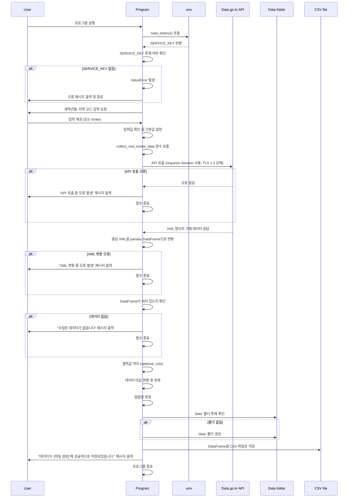
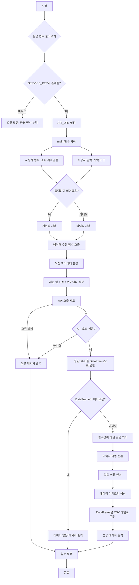
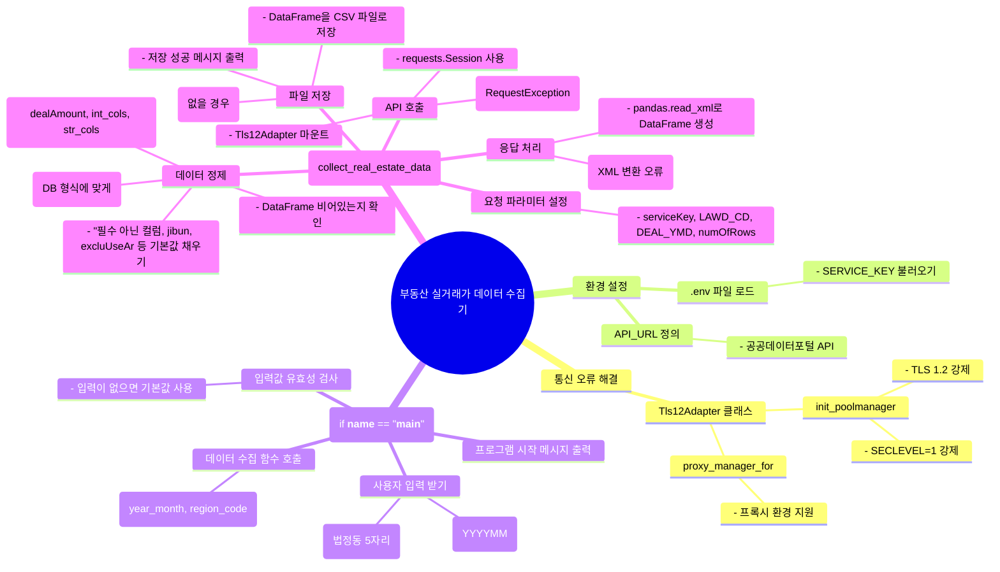

## 국토교통부 아파트 매매 실거래가 자료 공공 api를 사용해서 데이터를 자동 수집
XML -> csv 저장 -> DB 적재 순서
https://www.data.go.kr/data/15126469/openapi.do

### 다이어그램

```mermaid

sequenceDiagram
    participant U as User
    participant P as Program
    participant E as .env
    participant A as Data.go.kr API
    participant D as Data folder
    participant C as CSV file

    U->>P: 프로그램 실행
    P->>E: load_dotenv() 호출
    E-->>P: SERVICE_KEY 반환
    P->>P: SERVICE_KEY 존재 여부 확인
    alt SERVICE_KEY 없음
        P->>P: ValueError 발생
        P->>U: 오류 메시지 출력 및 종료
    end
    
    P->>U: 계약년월, 지역 코드 입력 요청
    U->>P: 입력 제공 (또는 Enter)
    P->>P: 입력값 확인 및 기본값 설정
    P->>P: collect_real_estate_data 함수 호출
    
    P->>A: API 호출 (requests.Session 사용, TLS 1.2 강제)
    alt API 호출 오류
        A-->>P: 오류 응답
        P->>U: "API 호출 중 오류 발생" 메시지 출력
        P->>P: 함수 종료
    end
    
    A-->>P: XML 형식의 거래 데이터 응답
    P->>P: 응답 XML을 pandas DataFrame으로 변환
    alt XML 변환 오류
        P->>U: "XML 변환 중 오류 발생" 메시지 출력
        P->>P: 함수 종료
    end
    
    P->>P: DataFrame이 비어 있는지 확인
    alt 데이터 없음
        P->>U: "수집된 데이터가 없습니다" 메시지 출력
        P->>P: 함수 종료
    end
    
    P->>P: 결측값 처리 (optional_cols)
    P->>P: 데이터 타입 변환 및 정제
    P->>P: 컬럼명 변경
    P->>D: 'data' 폴더 존재 확인
    alt 폴더 없음
        P->>D: 'data' 폴더 생성
    end
    
    P->>C: DataFrame을 CSV 파일로 저장
    P->>U: "데이터가 '{파일 경로}'에 성공적으로 저장되었습니다." 메시지 출력
    P->>P: 프로그램 종료

```

  

```mermaid

graph TD
    A[시작] --> B{환경 변수 불러오기};
    B --> C{SERVICE_KEY가 존재함?};
    C -- 아니오 --> D[오류 발생: 환경 변수 누락];
    C -- 예 --> E[API_URL 설정];
    E --> F[main 함수 시작];
    F --> G[사용자 입력: 조회 계약년월];
    F --> H[사용자 입력: 지역 코드];
    G --> I{입력값이 비어있음?};
    H --> I;
    I -- 예 --> J[기본값 사용];
    I -- 아니오 --> K[입력값 사용];
    J --> L[데이터 수집 함수 호출];
    K --> L;
    L --> M[요청 파라미터 설정];
    M --> N[세션 및 TLS 1.2 어댑터 설정];
    N --> O[API 호출 시도];
    O --> P{API 호출 성공?};
    O -- 오류 발생 --> Q[오류 메시지 출력];
    P -- 아니오 --> Q;
    P -- 예 --> R[응답 XML을 DataFrame으로 변환];
    R --> S{DataFrame이 비어있음?};
    S -- 예 --> T[데이터 없음 메시지 출력];
    S -- 아니오 --> U[필수값이 아닌 컬럼 처리];
    U --> V[데이터 타입 변환];
    V --> W[컬럼 이름 변경];
    W --> X[데이터 디렉토리 생성];
    X --> Y[DataFrame을 CSV 파일로 저장];
    Y --> Z[성공 메시지 출력];
    Q --> AA[함수 종료];
    T --> AA;
    Z --> AA;
    AA --> BB[종료];

```
  

```mermaid

mindmap
  root((부동산 실거래가 데이터 수집기))
    통신 오류 해결
      Tls12Adapter 클래스
        init_poolmanager
          - TLS 1.2 강제
          - SECLEVEL=1 강제
        proxy_manager_for
          - 프록시 환경 지원
    환경 설정
      .env 파일 로드
        - SERVICE_KEY 불러오기
      API_URL 정의
        - 공공데이터포털 API
    메인 로직 (if __name__ == "__main__")
      프로그램 시작 메시지 출력
      사용자 입력 받기
        - 계약년월 (YYYYMM)
        - 지역 코드 (법정동 5자리)
      입력값 유효성 검사
        - 입력이 없으면 기본값 사용
      데이터 수집 함수 호출
        - collect_real_estate_data(year_month, region_code)
    데이터 수집 함수 (collect_real_estate_data)
      요청 파라미터 설정
        - serviceKey, LAWD_CD, DEAL_YMD, numOfRows
      API 호출
        - requests.Session 사용
        - Tls12Adapter 마운트
        - 예외 처리 (RequestException)
      응답 처리
        - pandas.read_xml로 DataFrame 생성
        - 예외 처리 (XML 변환 오류)
      데이터 정제
        - DataFrame 비어있는지 확인
        - "필수 아닌 컬럼, jibun, excluUseAr 등 기본값 채우기
        - 데이터 타입 변환 (dealAmount, int_cols, str_cols)
        - 컬럼명 변경 (DB 형식에 맞게)
      파일 저장
        - 'data' 폴더 생성 (없을 경우)
        - DataFrame을 CSV 파일로 저장
        - 저장 성공 메시지 출력

```

