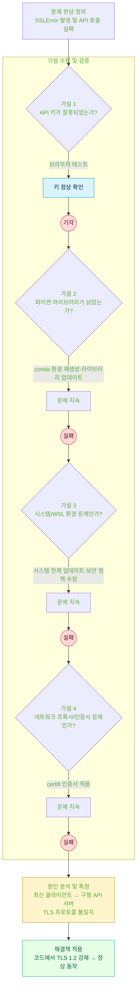

#### 설명 줄글 

https://velog.io/@nyangdev/Python%EA%B3%BC-SQL%EC%9D%84-%ED%99%9C%EC%9A%A9%ED%95%9C-%EB%B6%80%EB%8F%99%EC%82%B0-%EC%8B%A4%EA%B1%B0%EB%9E%98%EA%B0%80-%EB%8D%B0%EC%9D%B4%ED%84%B0-%ED%8C%8C%EC%9D%B4%ED%94%84%EB%9D%BC%EC%9D%B8-%EA%B5%AC%EC%B6%95
  
https://velog.io/@nyangdev/%EA%B3%B5%EA%B3%B5-API-%ED%98%B8%EC%B6%9C-%EC%8B%9C-%EB%B0%9C%EC%83%9D%ED%95%9C-SSLError-%ED%95%B4%EA%B2%B0-%EA%B3%BC%EC%A0%95

## 국토교통부 아파트 매매 실거래가 자료 공공 api를 사용해서 데이터를 자동 수집
XML -> csv 저장 -> DB 적재 순서
https://www.data.go.kr/data/15126469/openapi.do

### 다이어그램

  

  

